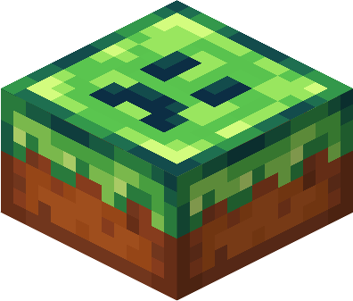
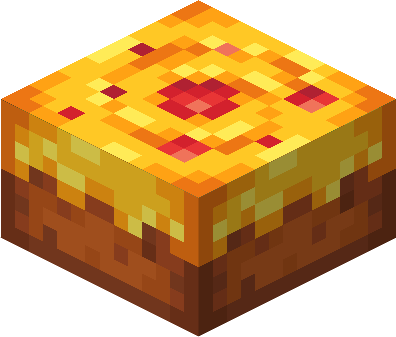
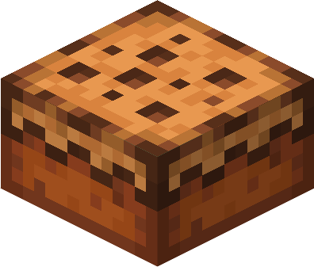
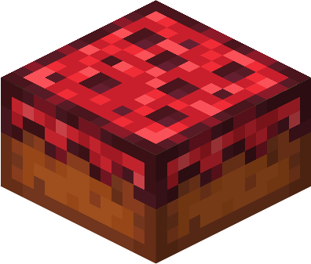
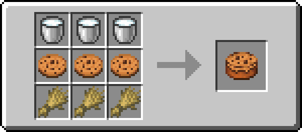

***Fabric also requires [Fabric API](https://modrinth.com/mod/fabric-api) and [Forge Config API Port](https://modrinth.com/mod/forge-config-api-port)!***

---

## About 📖

Delicious Cake is a both NeoForge and Fabric mod and the successor to Yummy Cakes.

If you don't know what Yummy Cakes is, this mod adds some delicious cakes!

The current cakes include:
- Glazed Cake
- Golden Apple Cake
- Cookie Cake
- Nether Cake

## Showcase 🖼️

### Cakes 🍰

**Glazed Cake**

A cake glazed with a sugary paste that looks like a creeper face.

**Golden Apple Cake**

A golden cake made out of gold nuggets and a golden apple, it will make you resistant and regenerate health.

**Cookie Cake**

A cake made out of cookies. Very crunchy, but may not be the best food source...

**Nether Cake**

A cake made out of nether warts, it makes you resistant to fire.

### Recipes 🔨

## Other 📚

This mod is configurable! You can install [Configured](https://www.curseforge.com/minecraft/mc-mods/configured) to change the config in-game. 

Found an issue or do you have feedback? Make an issue on the [issue tracker](https://github.com/Command17/DeliciousCake/issues)!

---

## My Other Mods 📦

|  |
|-------------------------------------------------------------------------------------------------------------------------------------------------|